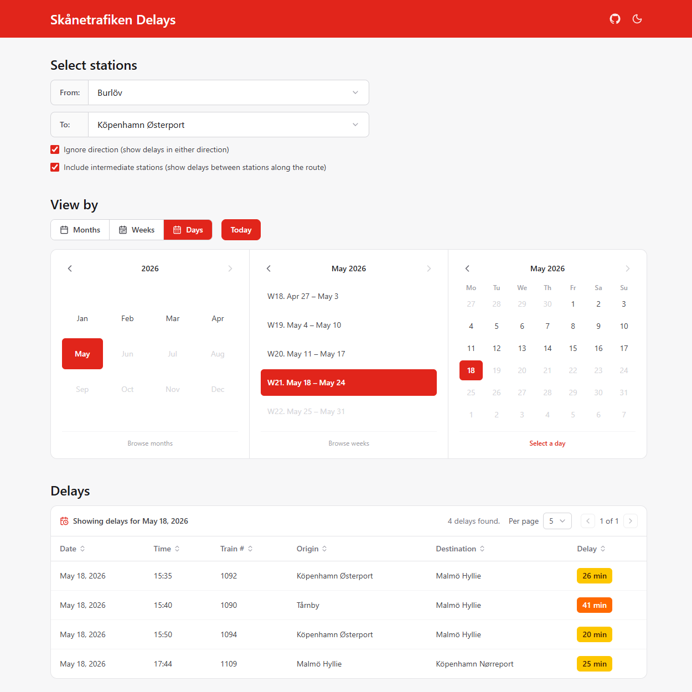

# Skånetrafiken Delays

Did the train you were on get delayed, but you can't remember which one it was? Or maybe it's winter and you can't even remember the last time the trains were not delayed? Fear no more, because [https://skanetrafiken-delays.se](https://skanetrafiken-delays.se/) keeps track of all delayed trains across the Öresund strait for you, both in real time and historically, so you can look back at past delays, patterns, and just how optimistic the timetable really was.

## Monorepo layout

This repository is a monorepo containing three projects:

- **[`frontend/`](frontend/)** — the [skanetrafiken-delays.se](https://skanetrafiken-delays.se/) web app that lets users browse delays in real time and historically.
- **[`backend/`](backend/)** — an AWS Lambda function that runs hourly, polls the Skånetrafiken API for delayed and cancelled journeys, and writes them to a DynamoDB table that the frontend reads from.
- **[`auto-form-filler/`](auto-form-filler/)** — a Puppeteer script that automates filling out Skånetrafiken's compensation claim form so you can apply for refunds without doing the clicking yourself.

